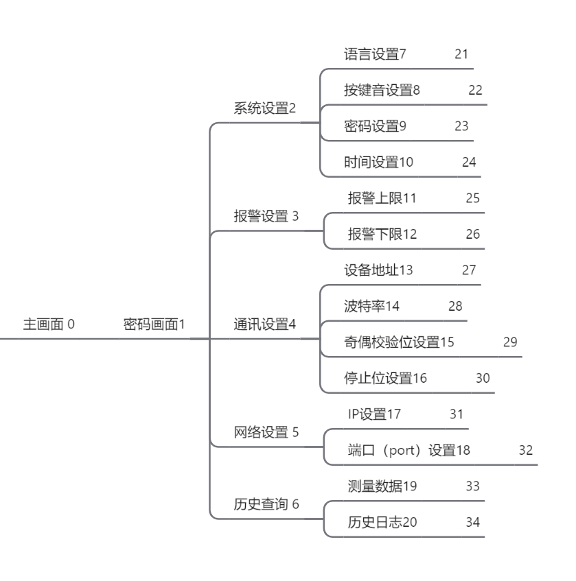

# 基于STM32物联网电压检测
# 功能列表
## 电压检测
ADC1采集外部IO口模拟量变化
## 显示时间
stm32内部RTC时钟实时显示时间
## 显示环境温度
ADC1通道16通过多通道扫描实时采集电压和芯片温度
## 多菜单界面
设计菜单为平铺菜单共计34个菜单项

每个菜单有一个对应的编号通过结构体数组访问不同菜单编号，通过每个结构数组对LCD屏显示不同内容从而实现多级菜单，需要显示那个界面就跳转到那个对应标号
## MODBUS通讯
modbus通讯实现了RTU和TCP/IP的通讯协议，RTU协议通过RS485走串口传输，而TCP/IP通过ESP8266通过WIFI实现无线传输
## 保存历史数据
每隔5s存储一次现场采集数据 存储格式为电压值、温度值、和采集时间
存储到E2PROM中
存储数据条数到200条后新采集的数据覆盖掉最早的一条
对菜单中设置内容更改后需要实时记录时间、所做操作

#代码模块
该工程在freertos环境中完成，通过将每个模块放到任务中运行完成
目前实现的模块：菜单初步框架、ADC实时采集显示到菜单、温度实时显示到菜单、RTC时间实时显示到菜单

